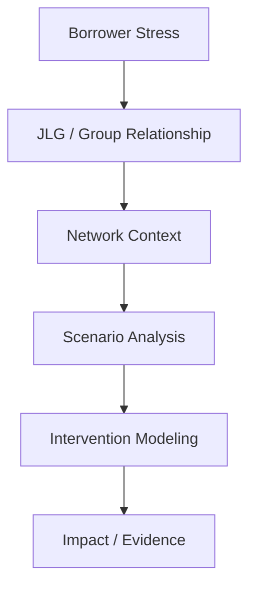
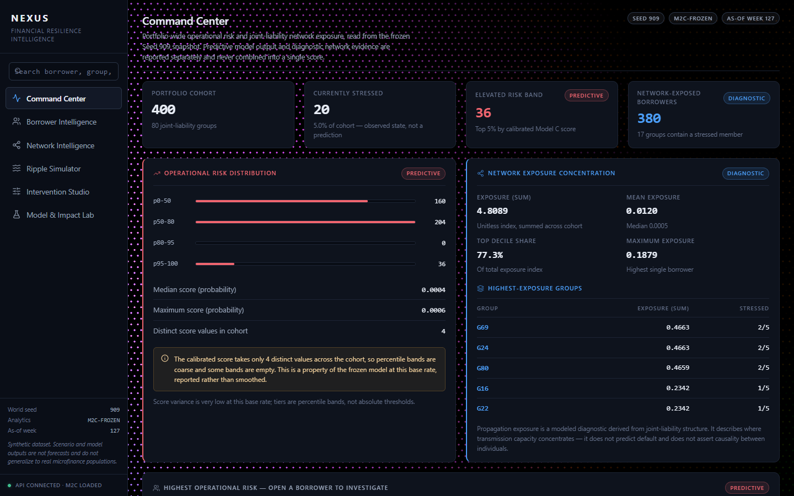
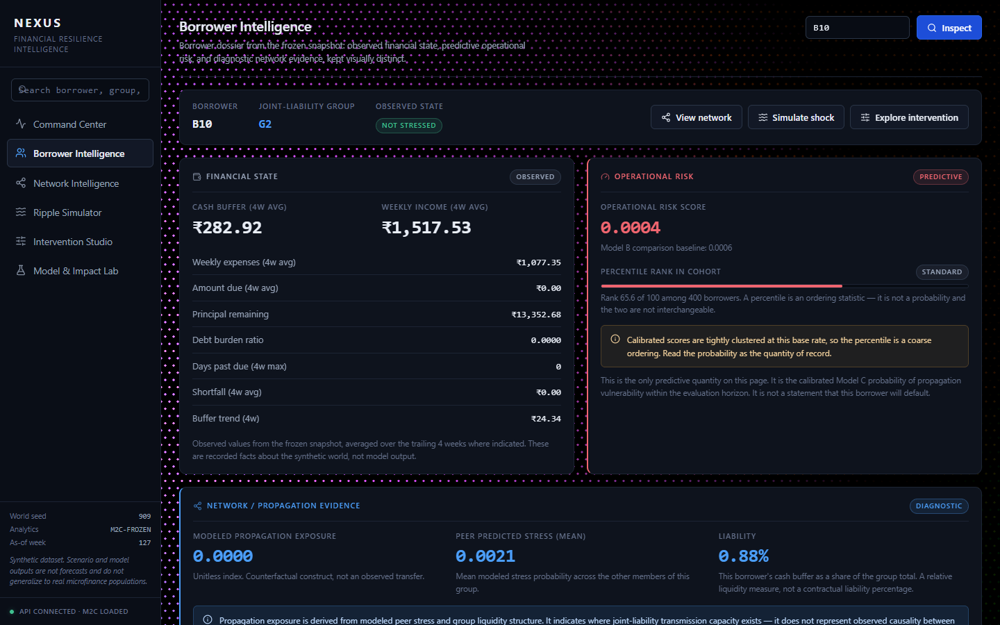
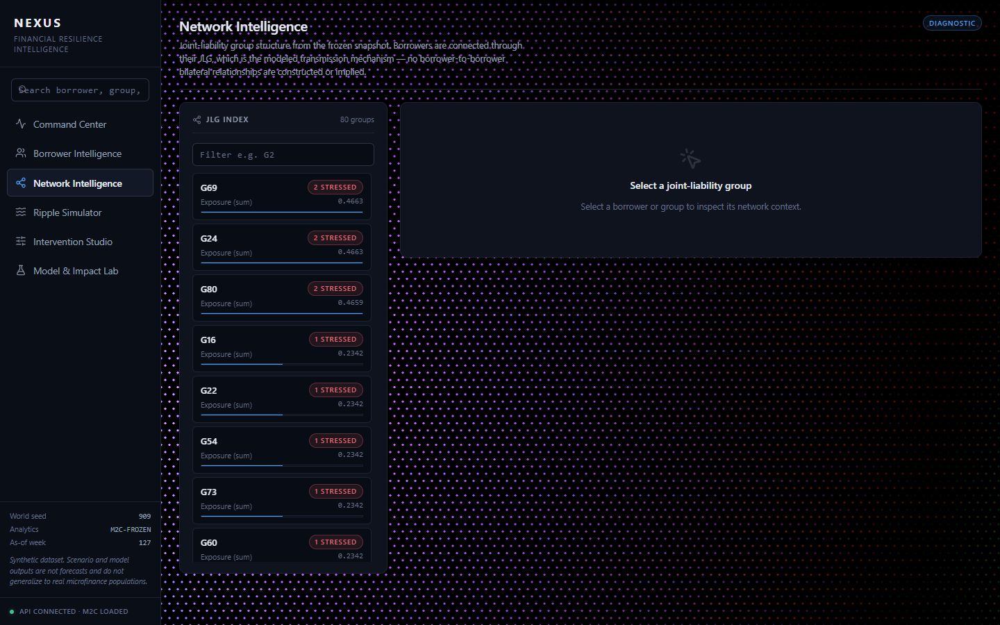
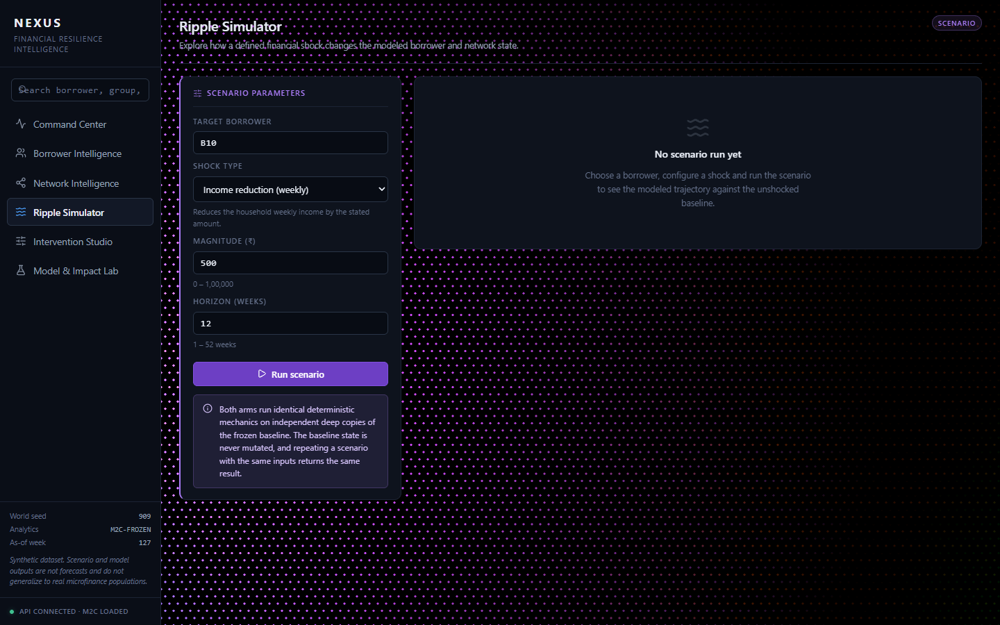
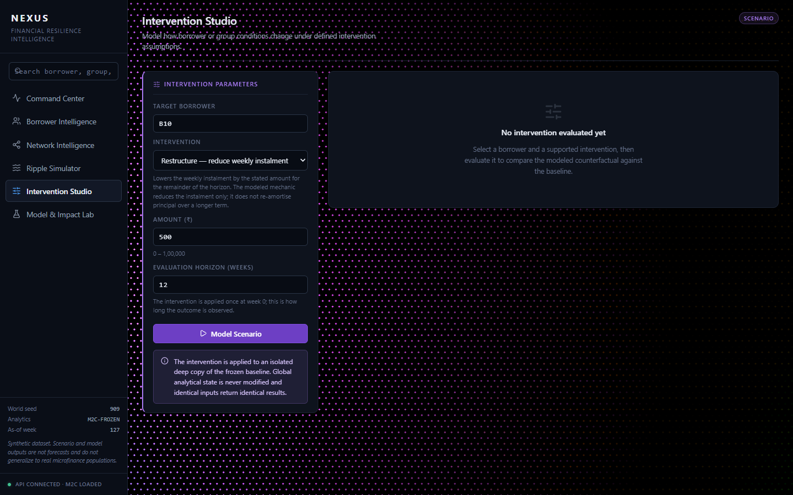
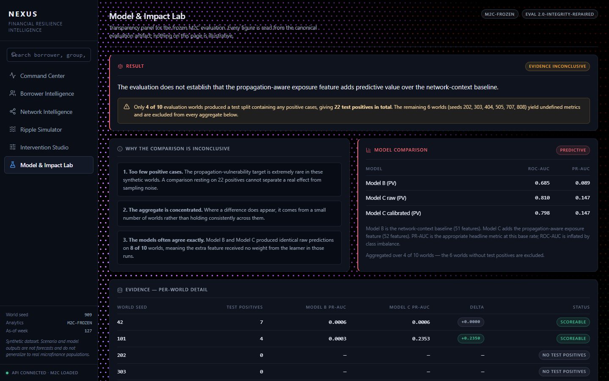
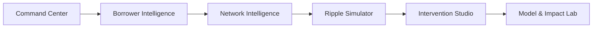
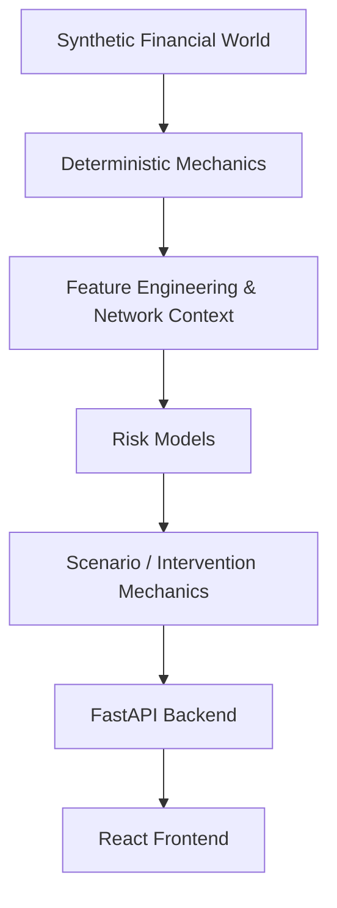

# NEXUS
**Financial Resilience Intelligence**

> *Understand how borrower stress moves through networked lending relationships.*

**OBSERVE** • **DIAGNOSE** • **CONNECT** • **SIMULATE** • **INTERVENE** • **MEASURE**

    

---

## PRODUCT OVERVIEW

NEXUS is an AI-powered Financial Risk Intelligence and Networked Microfinance Analytics platform. It addresses a critical gap in traditional credit risk assessment: **borrower-level risk alone can be insufficient in networked lending.**

In microfinance, particularly in Joint Liability Groups (JLGs) or Self-Help Groups (SHGs), a borrower's financial health is intertwined with their peers. A shock to one household can cascade through the group due to shared liability mechanisms. NEXUS moves beyond isolated predictions, offering a continuous workflow that connects risk analysis, network diagnostics, deterministic simulation, intervention scenarios, and empirical measurement into a single, cohesive investigation platform.

---

## THE PROBLEM

Financial stress signals in microfinance are often fragmented and lack surrounding network context. Traditional models output a probability of default but fail to answer *how* that stress might propagate or *what* happens under specific economic shocks. Furthermore, scenario analysis is often completely disconnected from the initial diagnostic risk models, and analytical uncertainty is hidden behind opaque headline metrics.



---

## THE NEXUS SOLUTION

NEXUS formalizes the investigation of network-driven financial stress into a six-stage workflow:

1. **OBSERVE**: What the portfolio looks like at a macro level.
2. **DIAGNOSE**: Why a specific borrower or group is being surfaced for attention.
3. **CONNECT**: How the individual case relates to their JLG and the broader network.
4. **SIMULATE**: What changes under a defined, deterministic economic shock.
5. **INTERVENE**: What is modeled under explicit intervention assumptions (e.g., grace periods, capital injections).
6. **MEASURE**: What the evidence actually supports regarding model performance and scientific conclusions.

---

## KEY PRODUCT FEATURES

NEXUS is composed of six purpose-built analytical workspaces:

### 1. Command Center



* **Purpose**: Portfolio-level triage and macro-risk observability.
* **What you see**: Key operational risk metrics, distribution of risk tiers, and aggregate network exposure.
* **Action**: Identify the highest-risk borrowers and most exposed groups for deeper investigation.
* **Why it matters**: Focuses limited institutional resources on the most vulnerable nodes in the network.

### 2. Borrower Intelligence



* **Purpose**: Deep-dive diagnostic view of an individual.
* **What you see**: Financial state (cash buffers, shortfalls), operational risk score (percentile rank), and network propagation exposure.
* **Action**: Evaluate the specific drivers of a borrower's vulnerability.
* **Why it matters**: contextualizes a raw probability score with concrete financial realities.

### 3. Network Intelligence



* **Purpose**: Visualization of group liability topologies.
* **What you see**: Star-topology graphs of JLG groups, showing how individual exposure aggregates at the group level.
* **Action**: Trace potential contagion paths within a specific group.
* **Why it matters**: Reveals hidden structural vulnerabilities that borrower-level models miss.

### 4. Ripple Simulator



* **Purpose**: Forward-looking stress testing.
* **What you see**: Side-by-side trajectories of a baseline state vs. a shocked scenario (e.g., income reduction, expense increase).
* **Action**: Define shock magnitude and duration, and watch the deterministic downstream effects on the borrower and their peers.
* **Why it matters**: Tests the resilience of the network under adverse conditions before they happen.

### 5. Intervention Studio



* **Purpose**: Actionable policy modeling.
* **What you see**: The counterfactual trajectory of a borrower's financial state under explicit intervention assumptions.
* **Action**: Apply specific interventions (e.g., cash injection) and measure the theoretical delta.
* **Why it matters**: Translates risk identification into actionable, measurable policy responses.

### 6. Model & Impact Lab



* **Purpose**: Transparency and scientific integrity.
* **What you see**: The actual evaluation metrics, temporal rules, and final conclusions of the underlying research.
* **Action**: Review the provenance, assumptions, and disclaimers of the analytical engine.
* **Why it matters**: Ensures the platform remains an honest diagnostic tool rather than a black-box oracle.

---

## HOW THE WORKFLOW CONNECTS

Context is preserved across the investigation flow. Selecting a borrower in the Command Center carries their ID through to the deeper diagnostic screens and directly into the Simulator and Intervention Studio.



---

## SYSTEM ARCHITECTURE

NEXUS is built on a clean separation of concerns, moving from foundational synthetic data generation up through deterministic mechanics, feature engineering, and finally the FastAPI and React layers.



**Key Modules:**
* `src/data.py`: Manages the loading and state of the frozen synthetic data artifacts.
* `src/mechanics.py`: The deterministic engine defining how cash buffers, shortfalls, and group liability coverage evolve week-over-week.
* `src/features*.py`: Extracts temporal, financial, and network-propagation features from the raw event stream.
* `src/interventions.py`: Defines the strict arithmetic for applying counterfactual interventions.
* `src/api/main.py`: The FastAPI application exposing the analytical engine to the frontend.

---

## DATA & SYNTHETIC WORLD

**NEXUS operates on a purely synthetic financial world.** No real borrower data is used.

The environment simulates borrowers, loans, weekly repayment behaviors, liquidity buffers, and Joint Liability Group (JLG) relationships over time. It models the lifecycle of delinquency and default under strict, deterministic rules (defined in `mechanics.py`). 

A synthetic environment is used to provide a controlled, reproducible baseline for experimentation, model evaluation, and scenario testing. It allows us to prove the mathematical consistency of the *workflow* without making unsupported claims about external validity on real-world populations.

---

## MACHINE LEARNING ARCHITECTURE

The analytical core evaluates multiple modeling approaches to isolate the value of network context:

* **M0**: Recent Delay Baseline (Simple heuristics).
* **Model A**: Individual Financial Baseline (Uses only borrower-level financial history).
* **Model B**: Individual + Network Context (Adds static group features and peer historical behaviors).
* **Model C**: Individual + Network + Propagation-Aware Exposure (Integrates the deterministic exposure features).

**Critical Distinctions:**
* **Predictive**: The Operational Risk Score is a calibrated probability (currently using Model C).
* **Diagnostic**: Network Propagation Evidence is descriptive information about group liability, *not* a prediction.
* **Scenario/Intervention**: The Simulator and Studio run on strict deterministic mechanics, independent of the ML models.

---

## MODEL EVALUATION & RESEARCH INTEGRITY

NEXUS enforces rigorous chronological evaluation to prevent data leakage:
* **Chronological Splits**: Strict out-of-time validation.
* **Purge Gap**: A mandatory minimum 4-week gap between training and testing periods.
* **Validation-only Calibration**: Probabilities are calibrated on strictly isolated out-of-fold data.
* **Independent Seeds**: Models are evaluated across multiple independent synthetic world seeds to test stability.

---

## M2C / M2D RESEARCH FINDINGS

NEXUS prioritizes scientific honesty over marketing claims. 

**M2C Evaluation (Current Frozen Baseline):**
The aggregate lift of Model C (propagation-aware) over Model A (individual baseline) was found to be **inconclusive**. Positive test cases (actual defaults) were sparse across the evaluated seeds, and the apparent performance gains were not stable enough to claim superiority.

**M2D Research:**
Subsequent research tested additional propagation-aware representations and variants. While useful as diagnostic indicators, the M2D study did not establish robust, universal incremental predictive value for the propagation features within this specific synthetic population.

The product currently surfaces the Model C score as an *operational* risk rank, but heavily emphasizes the deterministic Simulator and diagnostic views rather than relying solely on the ML probability.

---

## RESPONSIBLE AI / EVIDENCE MODEL

NEXUS clearly demarcates the nature of its outputs:

> [!IMPORTANT]
> * **PREDICTIVE**: Operational Risk Scores are probabilities, not certainties.
> * **DIAGNOSTIC**: Network Evidence shows structural exposure, not causal proof of failure.
> * **SCENARIO**: Simulations are deterministic counterfactuals based on strict arithmetic rules, not guaranteed forecasts.
> * **ASSUMPTIONS**: Intervention models show what *could* happen under stated assumptions, not historical efficacy.

---

## TECH STACK

| Layer | Technologies |
|---|---|
| **Frontend** | React (19.2), Vite, Vanilla CSS, React Router, Recharts, Lucide-React |
| **Backend** | Python 3.10+, FastAPI, Uvicorn |
| **Data & ML** | Pandas, NumPy, Scikit-learn, LightGBM, NetworkX |
| **Testing** | Pytest |

---

## PROJECT STRUCTURE

```text
NEXUS/
├── frontend/             # React SPA (Vite)
│   ├── src/
│   │   ├── components/   # UI Views (CommandCenter, Simulator, etc.)
│   │   ├── lib/          # API client (api.js)
│   │   └── index.css     # Design system & styles
│   └── package.json
├── src/                  # Python Analytical Core
│   ├── api/              # FastAPI application (main.py, data_store.py)
│   ├── models/           # ML model definitions
│   ├── data.py           # State management
│   ├── features.py       # Feature engineering
│   ├── mechanics.py      # Deterministic simulation rules
│   ├── targets.py        # Label generation
│   └── interventions.py  # Counterfactual logic
├── tests/                # Pytest suite
├── data/                 # Frozen synthetic artifacts (M2C baseline)
├── scripts/              # Helpers (start_demo.ps1)
├── README.md             
├── DEVELOPMENT.md        # Branching strategy
└── DEMO_GUIDE.md         # Demo walkthrough
```

---

## API OVERVIEW

The FastAPI backend provides a clean REST interface:

* `GET /health` - System status and data store readiness.
* `GET /portfolio/summary` - Macro risk distribution, top exposed groups, and aggregate metrics.
* `GET /borrower/{id}` - Individual financial state, operational risk tier, and network exposure.
* `GET /group/{id}` - JLG topology, member risk states, and aggregate liability.
* `GET /network` - List of all groups and their exposure profiles.
* `POST /simulate` - Runs a deterministic shock scenario (income/expense/cash) on a deep copy of the world state. Returns side-by-side trajectories.
* `POST /intervene` - Applies a counterfactual policy (e.g., cash injection) and returns the simulated delta.
* `GET /evaluation` - Retrieves the frozen M2C model evaluation metrics.
* `GET /assumptions` - Returns the scientific disclaimers and methodology rules.

---

## LOCAL SETUP

**Prerequisites:** Python 3.10+, Node.js 18+

1. **Clone & Setup Python Environment**
   ```bash
   pip install -r requirements.txt
   ```

2. **Start the Backend**
   ```bash
   python -m uvicorn src.api.main:app --host 127.0.0.1 --port 8000
   ```
   *API runs at http://127.0.0.1:8000*

3. **Build & Start the Frontend**
   > [!WARNING]
   > Due to a known Vite path-resolution issue with the `#` character in the project path (`M# 2026`), you **must** use the production build preview rather than `npm run dev`.
   ```bash
   cd frontend
   npm install
   npm run build
   npm run preview
   ```
   *UI runs at http://localhost:4173*

---

## DEMO GUIDE

1. **Command Center**: Review portfolio macro-risk and locate a high-risk borrower (e.g., B342) and a standard-risk borrower (e.g., B10).
2. **Borrower Intelligence**: Inspect the chosen borrower. Contrast their calibrated risk score with their concrete network exposure.
3. **Network Intelligence**: View the borrower's group (e.g., G2) to understand how individual exposure aggregates through the JLG liability mechanism.
4. **Ripple Simulator**: Target the borrower with a shock (e.g., 500 Rs income reduction for 12 weeks) and observe the deterministic ripple effect on peer cash buffers.
5. **Intervention Studio**: Model a counterfactual intervention to see the theoretical impact on the borrower's trajectory.
6. **Model & Impact Lab**: Review the transparency report and scientific disclaimers.

*(See `DEMO_GUIDE.md` for full presentation details).*

---

## TESTING

The analytical core is validated via `pytest`:
```bash
pytest tests/ -q
```
*(Currently testing API boundaries, temporal feature leakage, mechanics consistency, and propagation logic).*

---

## DESIGN / UX

NEXUS utilizes a premium, investigation-oriented design language:
* **Dark Analytical Workspace**: Reduces eye strain and emphasizes data.
* **Restrained Glass Surfaces**: High information density without visual clutter.
* **Progressive Disclosure**: Moves logically from portfolio macro-views to individual micro-diagnostics.
* **Context Preservation**: The six main views represent a single continuous investigation, not disconnected dashboards.

---

## RESPONSIBLE USE / LIMITATIONS

* **Synthetic Data**: NEXUS currently runs on a synthetic world and has not been validated on real institutional borrower populations.
* **Deterministic Mechanics**: Scenario outputs (Simulator/Interventions) are assumption-dependent mathematical projections, not guaranteed forecasts.
* **Diagnostic vs. Predictive**: Network evidence is diagnostic. It reveals structural exposure, but should not be interpreted as causal proof of default.
* **Deployment**: Any production deployment requires extensive, institution-specific calibration, governance, and real-world validation.

---

## ROADMAP

* **Future Work**: Integration with real institutional data.
* **Future Work**: Expanded research into Graph Neural Networks (GNNs) for more robust propagation modeling.
* **Future Work**: Role-based workflows tailored for Loan Officers vs. Risk Analysts.
* **Future Work**: Advanced model monitoring and concept-drift detection infrastructure.

---

## TEAM

* **Arnav**
* **Aanya**
* **Satvik**
* **Muhir**
* **Pranjay**

---

## FINAL CALL TO ACTION

**NEXUS**
*Observe. Diagnose. Connect. Simulate. Intervene. Measure.*

Explore the [Demo Guide](./DEMO_GUIDE.md) to get started with the local setup and experience the investigation workflow firsthand.
